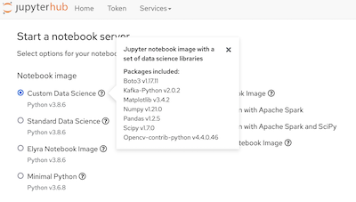

# Introduction

This repository contains a Dockerfile to allow an user to build a new custom notebook image for https://opendatahub.io/[Open Data Hub] JupyterHub.

The image is called "Custom Data Science".

The notebook is based on the Standard Data Science image from https://github.com/opendatahub-io/odh-manifests/blob/master/jupyterhub/notebook-images/overlays/additional/generic-data-science-notebook-imagestream.yaml[here].

## Installation Steps

Create the `BuildConfig` and `ImageStream` resources into the same namespace that JupyterHub is running.

[source, bash]
----
$ oc create -f yaml/custom-data-science-notebook-buildconfig.yaml -n odh
$ oc create -f yaml/custom-data-science-notebook-imagestream.yaml -n odh
----

And trigger a new build. This will build a new image from the git repository.

## Customization

To customize the image, fork this repository and update the  `.spec.source.git` in the `BuildConfig` to build from the new repository.

### Container Image

. `docker/Dockerfile`: Can be modified to install new libraries
. `docker/src/requirements.txt`: To install new python libraries into the image